架構

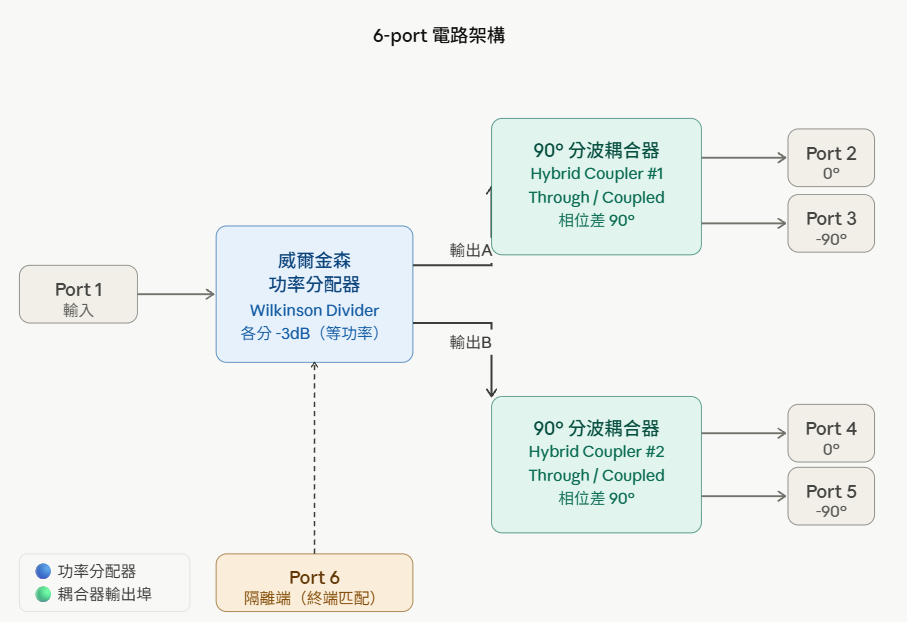


開始

1. 建立新專案
```
File → New → Workspace
→ 輸入名稱（如 SixPort_Design）
→ 選擇 "Create"
```


Step 2：建立 Schematic 並設定基板 (MSub)
Workspace 建好後，要新增一個 Schematic 視窗，再放入 MSub 基板元件
```
主視窗 → File → New → Schematic
→ Cell name: 輸入 sixport_schematic
→ OK
```

在左側搜尋欄搜尋 `MSub`，將其拖曳到 Schematic 視窗中
(如果左側搜尋消失可以手動開啟 : View → Docking windows → Component palette )

- 設定參數

| 參數   | 值         | 說明                       |
|:------ | ---------- | -------------------------- |
| `H`    | `0.9 mm`   | 基板厚度                   |
| `Er`   | `4.4`      | FR4 介電常數               |
| `Mur`  | `1`        | 磁導率（保持預設）         |
| `Cond` | `4.1e7`    | 銅的電導率                 |
| `T`    | `35 um`    | 銅箔厚度                   |
| `TanD` | `0`        | 損耗正切                   |
| `Hu`   | `1e+33 mm` | 微帶線上方到金屬蓋板的距離 |


Step 3. 設定 S 參數模擬
```
Simulate → S-Parameter Simulation
→ Start:  0 GHz
→ Stop:  10 GHz
→ Step: 0.01 MHz
```


Step 4. 放置元件


在左側搜尋蘭搜索這些元件 : `MLIN` / `MBEND` / `MTEE_ADS` / `MSUB` / `TermG` / `R`

- 元件功能

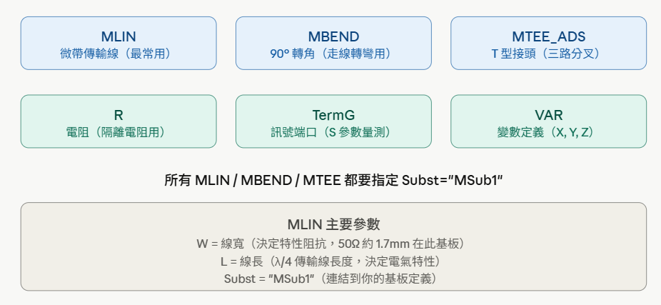


> **關鍵概念** :
> 
> **W（線寬）** → 只由阻抗 Zo 和基板參數決定，**跟頻率無關**
>
> **L（線長）** → 才跟頻率有關（頻率越高，λ/4 越短）


# Stage 1 . 一階威爾金生電路 ( freq = 5.8 GHz , Zo = 50 Ω )

- Reference : 
    - 微波工程 ( 作者 : 郭仁財 )  Pg. 314-317


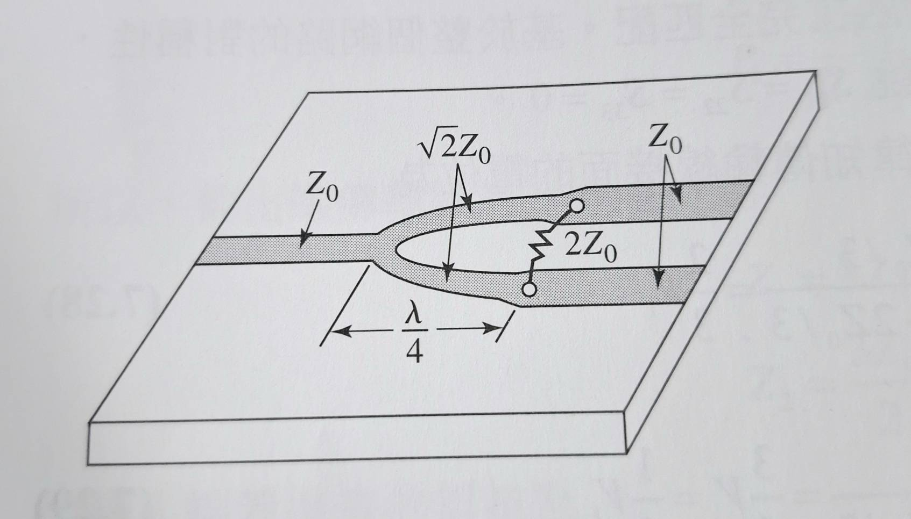


ADS 內建一個專門算微帶線的工具 ( `Tools` → `LineCalc` → `Start LineCalc`)

設定基板參數 > 輸入阻抗 > 按下 按下 Synthesize 就會得到對應的線寬 W 和線長 L

( Zo = 50 Ω  , 根號2* Zo = 70.71 Ω )

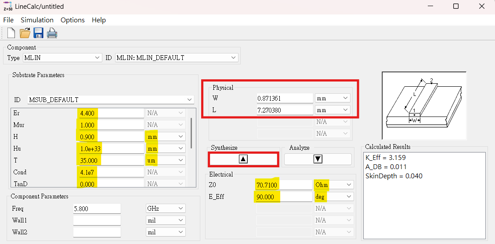


Step 5. 連接元件
將元件按照電路圖連接起來，並且在適當的位置放置 TermG 和 R 元件來模擬端口和負載

- 電路圖

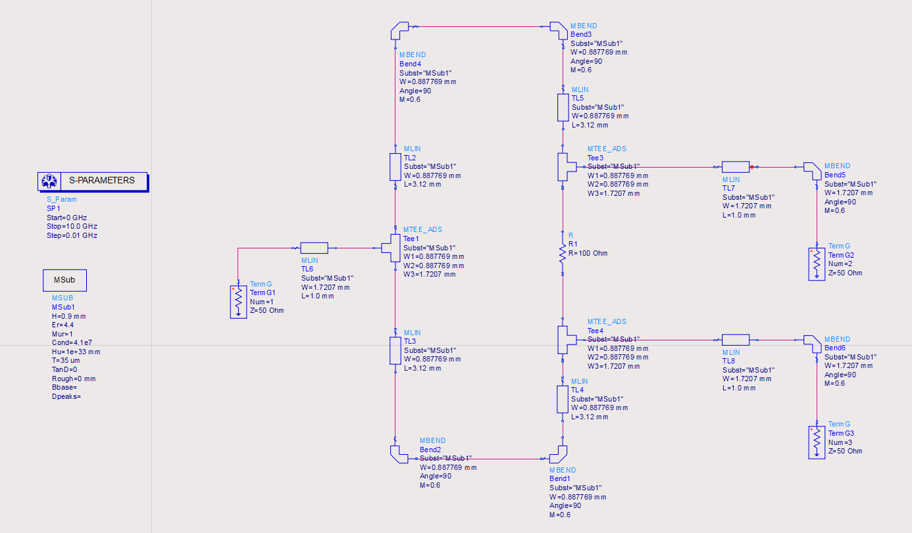


> 為什麼饋線 L 不需要是 λ/4？
>
> 威爾金森的工作原理只依賴中間那段 70.71Ω 的 λ/4 線來做阻抗變換。
>
> 輸入輸出的 50Ω 饋線，功能只是「把訊號從 Port 帶進來/送出去」，長度多一點少一點，只會讓訊號多走一小段路，不影響分配功能。
--------------------
> λ/4 那段不能一線畫到底，要分開來畫
>
> 核心原因：
> λ/4 線很長放不下基板，十分占空間

Step 6. 執行模擬

- 按下 "齒輪" 圖示
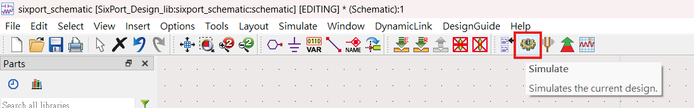

- 選擇剛剛建立的 S 參數模擬設定，按下 OK


模擬結果

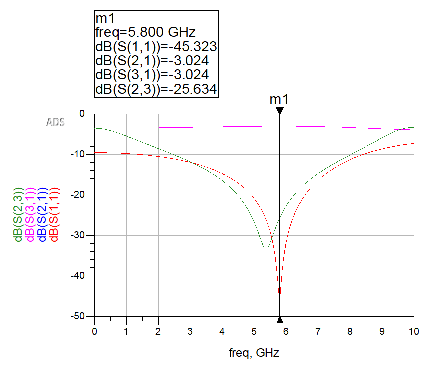
> **如何產生 `m1` 標示 :**   選取功能列 `Marker` > `New Line`

**重點** : 就算全是理論值，模擬結果也不會完美對齊中心頻率 5.8 GHz 的點。我們可以從下面幾個方法調整 : 

**Priority 1 :** 
```
# 微調 λ/4 分配臂的長度 

新 L = 舊 L × ( 目前中心頻率 / 5.8) 

-----這個比例法只是一階近似，因為：------

* Eeff（有效介電常數）本身也會隨頻率略微變化
* MTEE 接頭的電氣長度補償沒有算進去
```

**Priority 2 :** 
```
# 調整饋線 L 的長度

饋線 L  還沒短到完全「中性」。饋線還是貢獻了一點點額外電氣長度，把頻率稍微往低推
```


### 最終結果分析

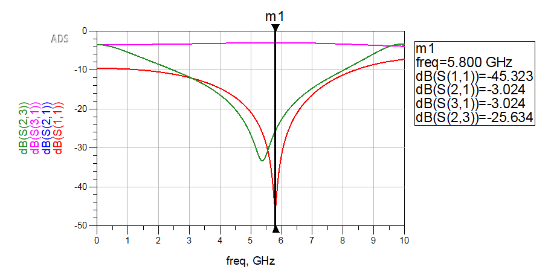

| 參數     | 5.8 GHz 的值 | 判讀                     |
|:-------- | ------------:| ------------------------ |
| `S(1,1)` |     `-45 dB` | 輸入匹配極佳 ✅          |
| `S(2,1)` |  `-3.024 dB` | 插入損耗正常 ✅          |
| `S(3,1)` |  `-3.024 dB` | 兩路完全對稱 ✅          |
| `S(2,3)` | `-25.634 dB` | 隔離度 > 20 dB ✅ 夠好了 |
|          |              |                          |


---------------------------------------------------------

# Stage 2 : 90-degree Hybrid Coupler ( freq = 5.8 GHz , Zo = 50 Ω )

90° 耦合器（Branch-Line Coupler）是這個 6-port 電路的第二個核心元件

- Reference : 微波工程 ( 作者 : 郭仁財 )  Pg. 328-331


| 端口   | 相位 | 說明                 |
|:------ | ----:| -------------------- |
| Port 1 |   0° | 輸入                 |
| Port 2 | -90° | Through port（直通） |
| Port 3 | 隔離 | 理想情況下無輸出     |
| Port 4 | -90° | Coupled port         |


- Z = 35.55 Ω 的 λ/4 線段對應的線寬 W 和線長 L   ( W = 2.887940 mm , L = 6.849040 mm )
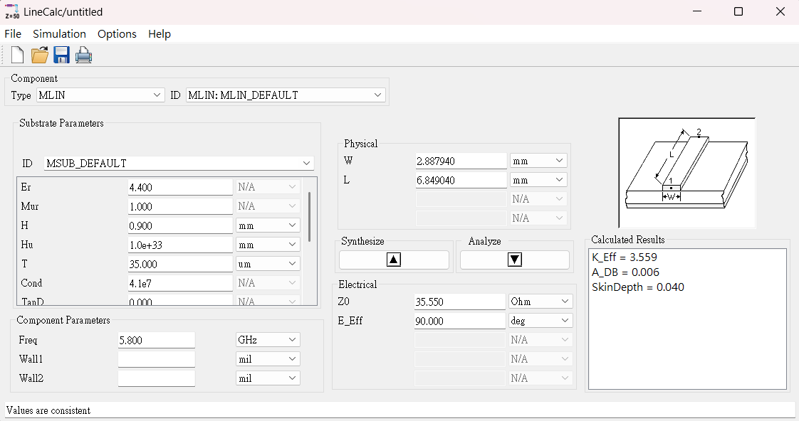


- Z = 50 Ω 的 λ/4 線段對應的線寬 W 和線長 L ( W = 1.68814 mm , L = 7.04647 mm )
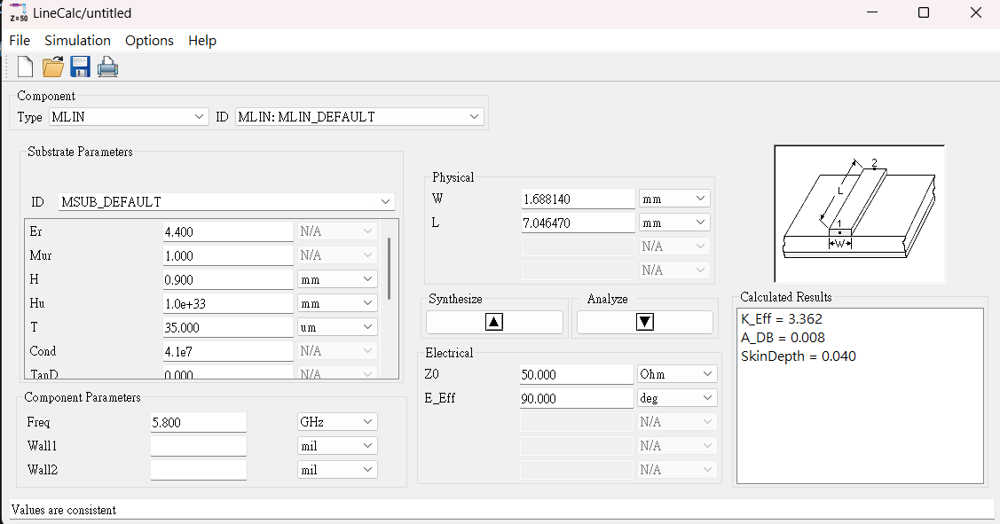


**快速驗證方法**
正確的總長應該是：

- 水平臂總長：6.84904 mm
- 垂直臂總長：7.04647 mm

EX : 
如果你的總長比這個大，中心頻率就會低於 5.8 GHz；比這個小，就會高於 5.8 GHz。
現在頻率在 6.4 GHz > 5.8 GHz，代表線太短了，需要加長。


**解決兩路功率不完全平均問題 :**

調整線寬 W
```
# 線寬 W 主要影響

特性阻抗
匹配
耦合強度
功率分配比例
```

常見規則：
```
線寬變寬 → 阻抗變低
線寬變窄 → 阻抗變高
```
例如：
```
S21 = -2.690 dB
S31 = -3.412 dB
```
代表兩路功率不完全平均，這時微調某些支路線寬來改善功率分配是合理的。 -----> 加寬 `TL7` 、 `TL8`


電路圖

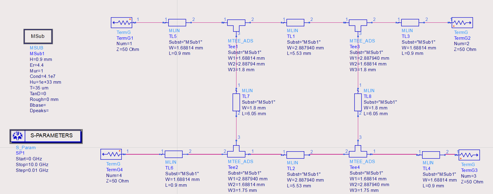

模擬

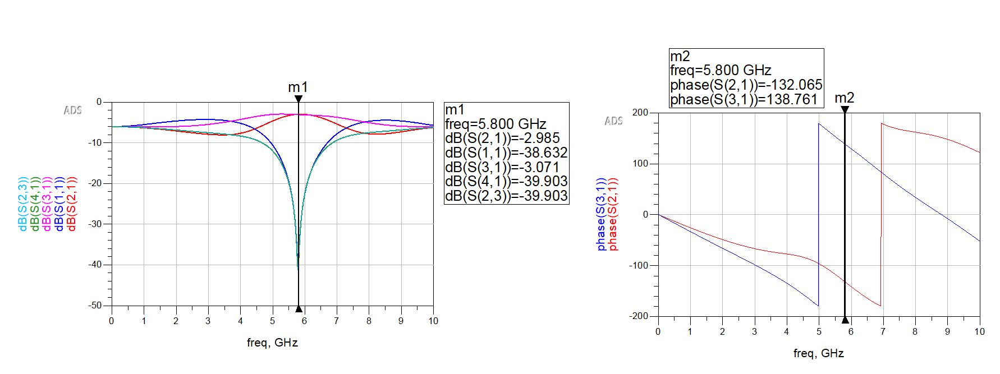


| 項目     |     目前數值 |       目標 | 評價      |
| -------- | ------------:| ----------:| --------- |
| `S(2,1)` |  `-3.005 dB` | 約 `-3 dB` | 非常好 ✅ |
| `S(3,1)` |  `-3.059 dB` | 約 `-3 dB` | 非常好 ✅ |
| `S(1,1)` | `-32.070 dB` | `< -15 dB` | 非常好 ✅ |
| `S(4,1)` | `-31.717 dB` | `< -20 dB` | 非常好 ✅ |
| `S(2,3)` | `-31.717 dB` | `< -20 dB` | 非常好 ✅ |
| 相位差   | 約 `-89.20°` |     `±90°` | 非常好 ✅ |

相位差計算：
```
phase(S(3,1)) - phase(S(2,1))
= 118.797° - (-152.005°)
= 270.802°
= -89.198° 約 -89.20°
```


**為什麼 branch-line coupler 不建議亂加 MBEND？**

因為 branch-line coupler 本身就是一個矩形四邊結構：
```
Port1 ───── Port2
  │           │
  │           │
Port4 ───── Port3
```

它的四個角是 `T-junction`，核心四條邊本來就要保持為特定阻抗與 λ/4 長度。

如果你把中間主線又額外折來折去，就會破壞原本的 branch-line 結構。

但 Wilkinson 不一樣，Wilkinson 的兩條分支線本質上就是兩條 λ/4 傳輸線，只要每條的總電氣長度和阻抗正確，它可以直，也可以彎。


# Stage 3 : 整合電路 ( 6-port Circuit)

- **Schematic**

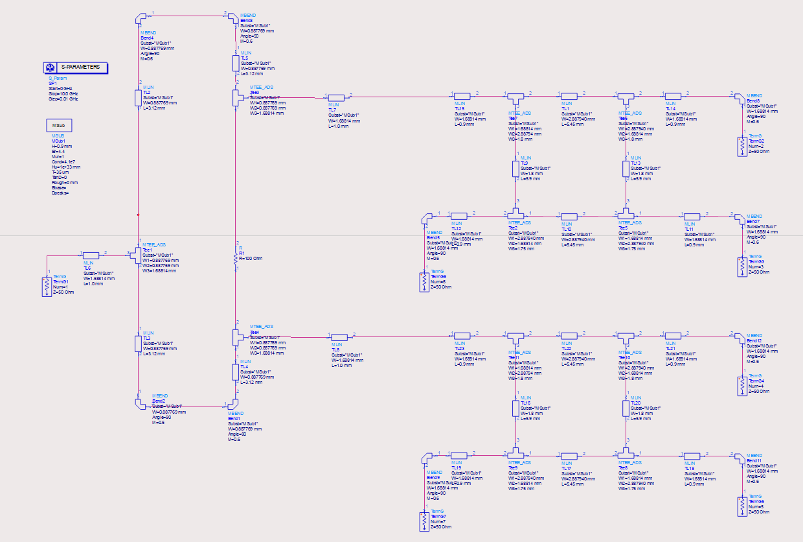


- **模擬結果**

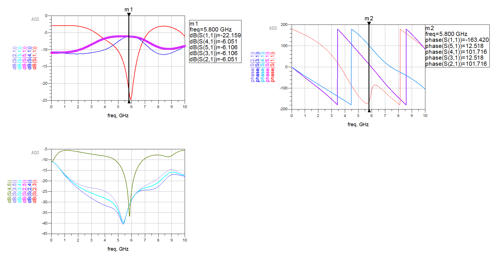


- **Conclusion**
在 5.8 GHz 時，四個輸出端皆約為 -6 dB，表示輸入功率成功平均分配至四個輸出端。輸出端之間的隔離度大多低於 -30 dB，顯示各輸出端之間互相干擾很小。此外，Port 2/4 與 Port 3/5 可分為兩組同相輸出，兩組之間相位差約為 89.2°，接近理想 90°，符合直角分波器的設計目標。


| 項目              |              結果 | 評價        |
| ----------------- | -----------------:| ----------- |
| 四路輸出功率      |        約 `-6 dB` | 平均分配 ✅ |
| 輸入匹配 `S(1,1)` |       約 `-22 dB` | 良好 ✅     |
| 輸出端隔離度      | 多數約 `< -30 dB` | 很好 ✅     |
| 相位差            |        約 `89.2°` | 接近 90° ✅ |


- 四個輸出相位關係

| 輸出端   |       相位 |
| -------- | ----------:|
| `S(2,1)` | `101.716°` |
| `S(3,1)` |  `12.518°` |
| `S(4,1)` | `101.716°` |
| `S(5,1)` |  `12.518°` |


```
Port 2 和 Port 4 同相
Port 3 和 Port 5 同相
```

而兩組之間的相位差是：
```
101.716° - 12.518° = 89.198°
```
所以：
```
相位差 ≈ 89.2°  

這非常接近理想的：90°
```

**根據教科書的理想直角分合波器相位關係，Port 1 到 Port 2 的相位移為 90°，Port 1 到 Port 3 的相位移為 180°，因此 Port 2 與 Port 3 兩輸出端之間的相位差為 90°。在 ADS 模擬中，由於傳輸線延伸、彎角與相位包覆效應，輸出端的絕對相位可能與教科書標示不同，因此本設計主要以兩輸出端的相對相位差作為判斷依據。**

### AutoCAD

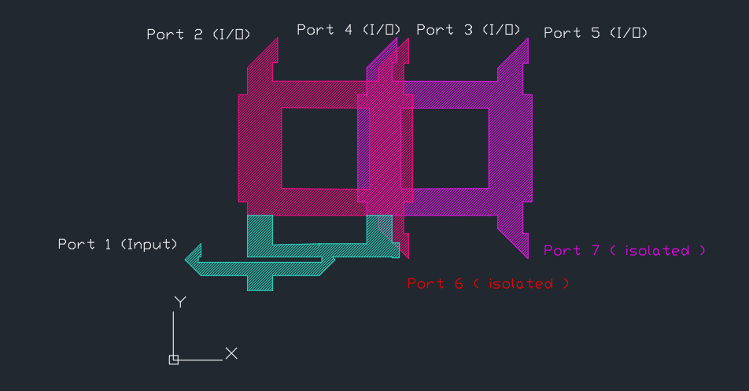


# Appendix


## Lincalc 

ADS 內建一個專門算微帶線的工具 ( `Tools` → `LineCalc` → `Start LineCalc`)


## m1

**如何產生 `m1` 標示 :**   選取功能列 `Marker` > `New Line`


## Pin number


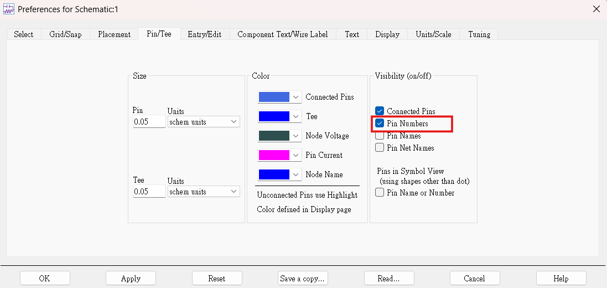


# W 和 L 的定義 
> 理論設計中，首先依據目標頻率與特性阻抗計算各段微帶線的初始線寬與線長。然而，由於實際微波電路中存在 T-junction、彎角、端口延伸線、基板損耗與寄生效應，理論尺寸無法完全反映實際電磁行為。因此，本設計以理論值作為初始尺寸，再透過 ADS 模擬觀察 S 參數，並微調線寬與線長，使中心頻率、輸入匹配、輸出功率分配、隔離度與相位差符合設計目標。


**線長 L 主要影響**
```
中心頻率
相位
共振點位置
```

常見規則：
```
中心頻率偏低 → 線太長 → 縮短 L
中心頻率偏高 → 線太短 → 加長 L
```
例如前面遇到目前最佳點在 5.5 GHz，但目標是 5.8 GHz，這時縮短主要線長就是合理的。


**線寬 W 主要影響**
```
特性阻抗
匹配
耦合強度
功率分配比例
```

常見規則：
```
線寬變寬 → 阻抗變低
線寬變窄 → 阻抗變高
```
例如：
```
S21 = -2.690 dB
S31 = -3.412 dB
```
代表兩路功率不完全平均，這時微調某些支路線寬來改善功率分配是合理的。


# 適合搭配 螢幕截圖 使用的工具

功能列 `View` > `View All` 可以讓你一次看到整個電路，適合搭配螢幕截圖使用

# 「理想 schematic」轉成「可實作 layout」

雖然一線到底的結果很好，但如果加入 MBEND、把水平線和垂直線折成實際 PCB 形狀，S 參數通常會變差，需要重新微調。

假如你現在的 MLIN 是直線，阻抗比較單純。

但是 90° 彎角不是單純的線段，它會產生額外寄生效應。可以理解成：
```
MBEND ≠ 純粹轉方向
MBEND = 轉方向 + 額外寄生電容 + 額外不連續
```

# 不要只看總物理長度，要看電氣長度

你不能只說：
```
直線 6 mm 改成 3 mm + bend + 3 mm
所以一樣
```
因為 MBEND 本身也有等效電氣長度與寄生效應。

比較安全的方式是：
```
原 MLIN 長度 L
改成 MLIN1 + MBEND + MLIN2
```
其中：
```
MLIN1 + MLIN2 通常要略小於原本 L
```
因為 MBEND 會額外貢獻一點等效長度。


# ADS 轉 autoCAD 繪圖

1. `View` > `Docking windows` > `Layers windows` > `Export to AutoCAD DXF`

keep  `ports` and `cond` . Delete other layers.

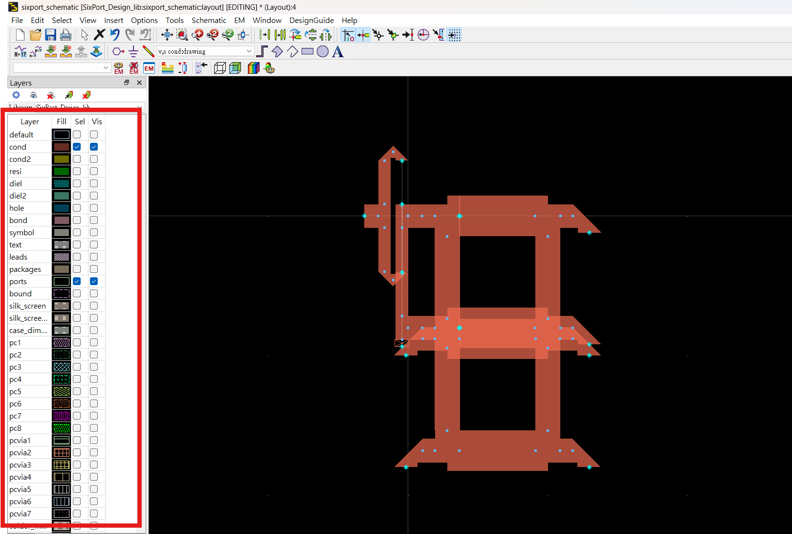

2. Eeport layout as DXF file : `File` → `Export` → `DXF`

本作業先使用 ADS 建立 6-port 微波電路模型，包含 Wilkinson power divider 與兩組 90° hybrid coupler。完成電路設計後，透過 S-parameter 模擬確認在 5.8 GHz 時輸入匹配、輸出功率分配、隔離度與相位差皆符合設計目標。接著使用 ADS Layout 產生微帶線幾何圖形，並匯出為 DXF 檔案，再於 AutoCAD 中進行版圖整理、Port 標示與圖面排版。