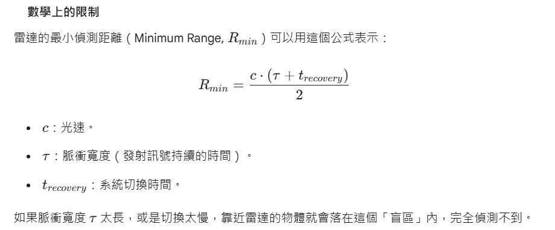

# Reference : 
- https://www.ti.com/video/series/mmwave-training-series.html
- https://ieeexplore.ieee.org/stamp/stamp.jsp?tp=&arnumber=6355801

# Learning mmWave Radar

## Observations

### 脈衝雷達（Pulse Radar）受限於 RToF 而無法用於短距

如果目標物太近，電磁波飛回來的時候，雷達還在「發射」或者「切換狀態」中，天線根本還沒準備好接收。這個反射訊號就會被強大的發射訊號給「淹沒」掉。

*脈衝雷達*

> **FMCW（調頻連續波) 雷達**
>
> 它是**「邊發邊收」**，沒有開關切換的問題，所以沒有最小距離限制（理論上可以測到 0 距離）。
>
> 但代價就是：為了提高解析度，它必須在極短時間內大幅改變頻率（斜波陡峭），這對硬體要求極高，容易產生相位雜訊（Phase Noise）。

###  微波波長

**24GHz（24G）**微波的波長約為 1.25公分（12.5毫米）。 

**特性**： 相較於較低頻的微波（如5.8GHz），24G微波波長更短，因此具有更高的解析度、更優異的抗干擾能力和穿透性。

**應用**： 常應用於短距離（<50公尺）的毫米波雷達，如智能家居、自動門感應、交通監控等領域。

